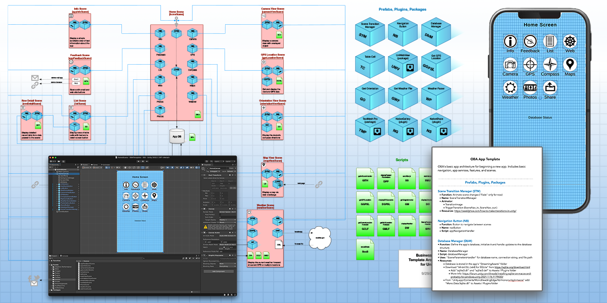
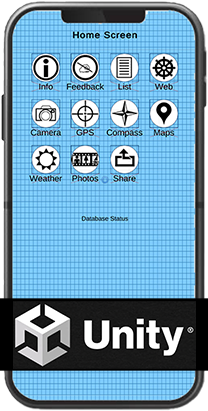
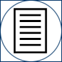
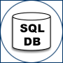
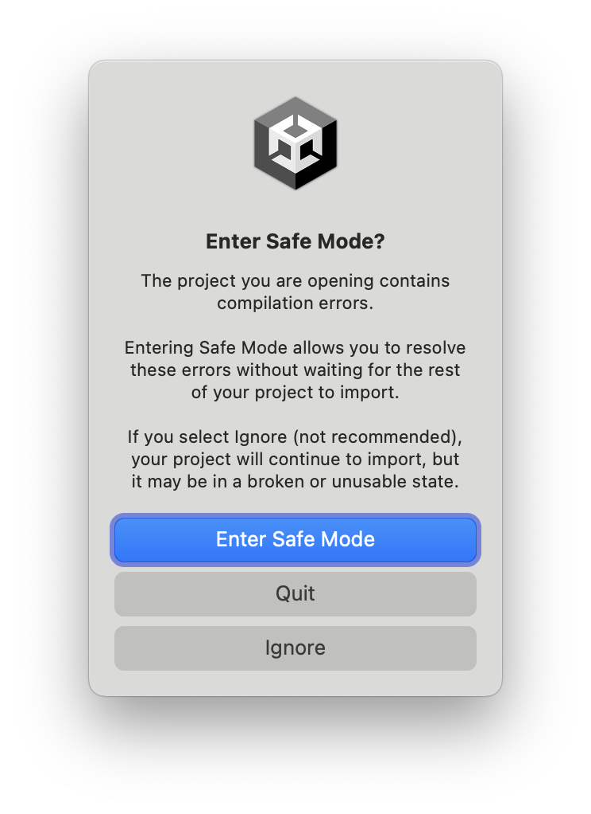

<!--
*** I'm using markdown "reference style" links for readability.
*** Reference links are enclosed in brackets [ ] instead of parentheses ( ).
*** See the bottom of this document for the declaration of the reference variables
*** for contributors-url, forks-url, etc. This is an optional, concise syntax you may use.
*** https://www.markdownguide.org/basic-syntax/#reference-style-links
-->
[![MIT License][license-shield]][license-url]
[![LinkedIn][linkedin-shield]][linkedin-url]
[![Twitter][Twitter-shield]][Twitter-url]
[![Facebook][Facebook-shield]][Facebook-url]
[![OBA][OBA-shield]][OBA-url]
[![Paypal][Paypal-shield]][Paypal-url]

<!-- PROJECT LOGO -->
 

  

  <h3 align="center">One Bad Ant Unity Business App Template</h3>

  

    OBA's basic app architecture for beginning a new "business-focused" app. Includes basic navigation, app services, features, prefabs, scripts, and scenes.
     
    <a href="https://github.com/Antkmk/UnityBATemplate"><strong>Explore the docs »</strong></a>
     
     
    <a href="https://github.com/Antkmk/UnityBATemplate/issues">Report Bug</a>
    ·
    <a href="https://github.com/Antkmk/UnityBATemplate/issues">Request Feature</a>
  

<!-- BUSINESS APP DEFINITION -->
## Business App?

This is a Unity app development project. I've created a working template for "business-focused" apps that includes a number of features that I use in my apps. You can pick and choose the features that you need and remove the ones you don't.

The app's UI is functional. There's not a lot (any) pretty elements because this is simply a template. The functionality is all in place and it is a starting point for developing your full-featured app and adding your professional graphics.

My definition of "business-focused" is an app template that features the management, tracking, and presentation of information rather than game play. See the list of features below.

I also have <a href="http://www.onebadant.com/index.php/oba-articles/288-gameapppattern">card game architecture</a> outlining how I built an app using Solar2d. At some point I may build a basic Unity card game template.

(<a href="#readme-top">back to top</a>)

## The What, Why, Where and How of the Template

<b>WHAT</b> I've created : a working app that includes the following features.

1. Screen Navigation: ("scenes" in Unity).  The ability to navigate to self-contained screens of different information and app features.
2. Tables:  Lists (rows) of rich content (images, text, UI elements)
3. Web:  
Ability to display a web page in the app.
4. Feedback & Contact:  
Send an email, go to a web site.
5. Photo Library:  
Ability to select and display a photo from the device's photo gallery
6. Social Share:  
Ability to share and post information to social media outlets
7. Camera View:  
Stream the device's camera view as a precursor to creating augmented reality features.
8. GPS Location:  
Get the device's current location.
9. Maps:  
Display maps and markers
10. Weather:  
Get and display the current weather forecast for a given GPS coordinate
11. Database:  
Initialize and create an SQLite database. Store and retrieve data.

There is a larger article with background on why I created this template which you can read <a href="http://www.onebadant.com/index.php/oba-articles/295-unitysolar">if you're interested</a>.

<b>WHY</b> I created it: To learn unity, test its abilities, and to create a template to use as a starting point for future Unity app development.

<b>WHERE</b> you can download: On my <a href="https://github.com/Antkmk/UnityBATemplate">Github repository</a>.

You'll find documentation outlining the prefabs, scripts, scenes, and resources used in the app. You'll also find a PDF document that diagrams the architecture of the app and its features. 

<b>HOW</b> to use the template: The two PDF documents, one a written outline of all the prefabs, screens and scripts, the other an architectural diagram describe everything that goes into this app. The documentation also includes links to some of the resources, solutions, and "how tos" that I found useful.

You can view or use individual scripts in the repository if you don't want the entire template. The code is free to use and I hope you find it helpful. 

(<a href="#readme-top">back to top</a>)

<!-- INSTALLATION -->
## Installation

Most features have been built to run in the Unity editor and on an Android or iOS device.

<ol>
<li>Download the repository. The app's main codebase is in the "OBAUnityTemplate" folder.</li>
<li>When you launch the project you may see a screen shot asking if you want to "Enter Safe Mode?". Press the "Ignore" button (see the image to the right).</li>
<li>You will see messages in the Console about missing "UniWebView". This is because this is a paid asset that I can not include in the template. To get rid of these message you can either (1) <a href="https://assetstore.unity.com/packages/tools/network/uniwebview-5-229334">purchase the UniWebView plugin</a> from the Unity Asset Store</li> or (2) you can delete the "webViewScene" and the "mapViewScene" in the project's "Scenes" folder and the "loadMap" script in the project's "Scripts" folder.
<li>The template is designed to run in portrait mode, so you should select an appropriate screen dimension.</li>
<li>You should be all set at this point to build and run the app. If something doesn't work, you find an issue, or need clearer instructions, <a href="mailto:ant@onebadant.com">let me know</a>!</li>
</ol>

(<a href="#readme-top">back to top</a>)

<!-- BUILT WITH -->
## Built With

<ul>
  <li>Visual Studio version 17.3.6</li>
  <li>Unity Editor version 2022.1.19</li>
  <li>Xcode 14.0.1</li>
</ul>

(<a href="#readme-top">back to top</a>)

## Your Support Appreciated!

You can download the code and documentation and use them for free. Although if you find this useful, donations can be made via Paypal and are appreciated.

If you have questions, find broken features, have requests for additional features, or have constructive feedback, let me know!

Cheers! ~Keith

(<a href="#readme-top">back to top</a>)

<!-- LICENSE -->
## License

Distributed under the MIT License. See `LICENSE.txt` for more information.

(<a href="#readme-top">back to top</a>)

<!-- CONTACT -->
## Contact

<b>Keith Kubarek</b>

Email: <a href="mailto:ant@onebadant.com">Keith</a>

Github Project: <a href="https://github.com/Antkmk/UnityBATemplate">repository</a>

Twitter: <a href="https://twitter.com/antkmk">@antkmk</a>

One Bad Ant: <a href="https://onebadant.com">web site</a>

One Bad Ant: <a href="https://www.facebook.com/Onebadant/">Facebook page</a>

Keith Kubarek: <a href="https://www.linkedin.com/in/keithkubarek/">Linkedin page</a>

(<a href="#readme-top">back to top</a>)

<!-- RESOURCES -->
## Resources

Some useful online resources to accompany this template:

* [Unity Transitions](https://weeklyhow.com/how-to-make-transitions-in-unity/)
* [Database Management](https://forum.unity.com/threads/installing-sqlite-on-macos-and-probably-for-windows-unity-2021-1-16.1179430/)
* [Unity SQL Code Example](https://github.com/robertohuertasm/SQLite4Unity3d)
* [Configuring Database Plugins](https://www.youtube.com/watch?v=oPEl0mzeYoQ)
* [GPS Youtube Video Tutorial](https://www.youtube.com/watch?v=ZdyfjJbVvDk)
* [Unity Location Services](https://docs.unity3d.com/ScriptReference/LocationService.Start.html)
* [Weather Service](https://graphical.weather.gov)
* [Download a File and Store Locally](https://docs.unity3d.com/Manual/UnityWebRequest-CreatingDownloadHandlers.html)
* [XML File parsing - search tutorials for "XML"](https://www.youtube.com/c/KindsonTheTechPro)
* [Scroll View How To](https://www.youtube.com/watch?v=Q-G-W93jhYc)
* [Create Table with Rows of Data](https://www.youtube.com/watch?v=hlNaNtApIMk)
* [UniWebView from Asset Store](https://assetstore.unity.com/packages/tools/network/uniwebview-4-175993)
* [Camera View](https://csharp.hotexamples.com/examples/UnityEngine/WebCamTexture/-/php-webcamtexture-class-examples.html)
* [Compass View](https://tutorialsforar.com/create-an-ar-compass-app-using-ar-foundation-and-unity/)
* [NativeGallery Plugin](https://github.com/yasirkula/UnityNativeGallery)
* [NativeShare Plugin](https://github.com/yasirkula/UnityNativeShare)

(<a href="#readme-top">back to top</a>)

<!-- MARKDOWN LINKS & IMAGES -->
<!-- https://www.markdownguide.org/basic-syntax/#reference-style-links -->
[issues-shield]: https://img.shields.io/github/issues/othneildrew/Best-README-Template.svg?style=for-the-badge
[issues-url]: https://github.com/othneildrew/Best-README-Template/issues
[license-shield]: https://img.shields.io/github/license/othneildrew/Best-README-Template.svg?style=for-the-badge
[license-url]: https://github.com/othneildrew/Best-README-Template/blob/master/LICENSE.txt
[linkedin-shield]: https://img.shields.io/badge/-LinkedIn-black.svg?style=for-the-badge&logo=linkedin&colorB=555
[linkedin-url]: https://www.linkedin.com/in/keithkubarek/
[Twitter-shield]: https://img.shields.io/badge/-Twitter-black.svg?style=for-the-badge&logo=Twitter&colorB=555
[Twitter-url]: https://twitter.com/antkmk
[Facebook-shield]: https://img.shields.io/badge/-Facebook-black.svg?style=for-the-badge&logo=Facebook&colorB=555
[Facebook-url]: https://www.facebook.com/Onebadant/
[product-screenshot]: images/screenshot.png

[OBA-shield]: https://img.shields.io/badge/website-555555?style=for-the-badge&logo=About.me&logoColor=white
[OBA-url]: https://onebadant.com/

[Paypal-shield]: https://img.shields.io/badge/PayPal-555555?style=for-the-badge&logo=paypal&logoColor=white
[Paypal-url]: https://www.paypal.com/donate/?hosted_button_id=JC9LWKY2YK252

