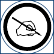

<a name="readme-top"></a>
<!--
*** I'm using markdown "reference style" links for readability.
*** Reference links are enclosed in brackets [ ] instead of parentheses ( ).
*** See the bottom of this document for the declaration of the reference variables
*** for contributors-url, forks-url, etc. This is an optional, concise syntax you may use.
*** https://www.markdownguide.org/basic-syntax/#reference-style-links
-->
[![MIT License][license-shield]][license-url]
[![LinkedIn][linkedin-shield]][linkedin-url]
[![Twitter][Twitter-shield]][Twitter-url]
[![Facebook][Facebook-shield]][Facebook-url]
[![OBA][OBA-shield]][OBA-url]

<!-- PROJECT LOGO -->
<br />
<div align="center">
  <a href="https://github.com/othneildrew/Best-README-Template">
    
  </a>

  <h3 align="center">One Bad Ant Unity Business App Template</h3>

  <p align="center">
    OBA's basic app architecture for beginning a new "business-focused" app. Includes basic navigation, app services, features, prefabs, scripts, and scenes.
    <br />
    <a href="https://github.com/Antkmk/UnityBATemplate"><strong>Explore the docs »</strong></a>
    <br />
    <br />
    <a href="https://github.com/Antkmk/UnityBATemplate/issues">Report Bug</a>
    ·
    <a href="https://github.com/Antkmk/UnityBATemplate/issues">Request Feature</a>
  </p>
</div>


<!-- TABLE OF CONTENTS -->
<details>
  <summary>Table of Contents</summary>
  <ol>
    <li>
      <a href="#businessapp">Business App?</a>
    </li>
    <li>
      <a href="#whatwhy"The What, Why, Where and How of the Template</a>
    </li>
    <li>
      <a href="#getting-started">Getting Started</a>
      <ul>
        <li><a href="#prerequisites">Prerequisites</a></li>
        <li><a href="#installation">Installation</a></li>
      </ul>
    </li>
    <li><a href="#usage">Usage</a></li>
    <li><a href="#roadmap">Roadmap</a></li>
    <li><a href="#contributing">Contributing</a></li>
    <li><a href="#license">License</a></li>
    <li><a href="#contact">Contact</a></li>
    <li><a href="#acknowledgments">Acknowledgments</a></li>
  </ol>
</details>


<!-- BUSINESS APP DEFINITION -->
## Business App?

<p>This is a Unity app development project. I've created a working template for "business-focused" apps that includes a number of features that I use in my apps. You can pick and choose the features that you need and remove the ones you don't.</p>

<p>The app's UI is functional. There's not a lot (any) pretty elements because this is simply a template. The functionality is all in place and it is a starting point for developing your full-featured app and adding your professional graphics.</p>

<p>My definition of "business-focused" is an app template that features the management, tracking, and presentation of information rather than game play. See the list of features below.</p>

<p>I also have card [game architecture](http://www.onebadant.com/index.php/oba-articles/288-gameapppattern) outlining how I built an app using Solar2d. At some point I may build a basic Unity card game template.</p>

<p align="right">(<a href="#readme-top">back to top</a>)</p>


## The What, Why, Where and How of the Template

<p>What I've created : a working app that includes the following features.</p>

1. Screen Navigation: ("scenes" in Unity). 
The ability to navigate to self-contained screens of different information and app features.
2. Tables: Lists 
(rows) of rich content (images, text, UI elements)
3. Web: 
Ability to display a web page in the app.
4. Feedback & Contact: 
Send an email, go to a web site.
5. Photo Library: 
Ability to select and display a photo from the device's photo gallery
6. Social Share: 
Ability to share and post information to social media outlets
7. Camera View: 
Stream the device's camera view as a precursor to creating augmented reality features.
8. GPS Location: 
Get the device's current location.
9. Maps: 
Display maps and markers
10. Weather: 
Get and display the current weather forecast for a given GPS coordinate
11. Database: 
Initialize and create an SQLite database. Store and retrieve data.

<p align="right">(<a href="#readme-top">back to top</a>)</p>


<!-- GETTING STARTED -->
## Getting Started

This is an example of how you may give instructions on setting up your project locally.
To get a local copy up and running follow these simple example steps.

### Prerequisites

This is an example of how to list things you need to use the software and how to install them.
* npm
  ```sh
  npm install npm@latest -g
  ```

### Installation

_Below is an example of how you can instruct your audience on installing and setting up your app. This template doesn't rely on any external dependencies or services._

1. Get a free API Key at [https://example.com](https://example.com)
2. Clone the repo
   ```sh
   git clone https://github.com/your_username_/Project-Name.git
   ```
3. Install NPM packages
   ```sh
   npm install
   ```
4. Enter your API in `config.js`
   ```js
   const API_KEY = 'ENTER YOUR API';
   ```

<p align="right">(<a href="#readme-top">back to top</a>)</p>


<!-- USAGE EXAMPLES -->
## Usage

Use this space to show useful examples of how a project can be used. Additional screenshots, code examples and demos work well in this space. You may also link to more resources.

_For more examples, please refer to the [Documentation](https://example.com)_

<p align="right">(<a href="#readme-top">back to top</a>)</p>


<!-- ROADMAP -->
## Roadmap

- [x] Add Changelog
- [x] Add back to top links
- [ ] Add Additional Templates w/ Examples
- [ ] Add "components" document to easily copy & paste sections of the readme
- [ ] Multi-language Support
    - [ ] Chinese
    - [ ] Spanish

See the [open issues](https://github.com/othneildrew/Best-README-Template/issues) for a full list of proposed features (and known issues).

<p align="right">(<a href="#readme-top">back to top</a>)</p>


<!-- CONTRIBUTING -->
## Contributing

Contributions are what make the open source community such an amazing place to learn, inspire, and create. Any contributions you make are **greatly appreciated**.

If you have a suggestion that would make this better, please fork the repo and create a pull request. You can also simply open an issue with the tag "enhancement".
Don't forget to give the project a star! Thanks again!

1. Fork the Project
2. Create your Feature Branch (`git checkout -b feature/AmazingFeature`)
3. Commit your Changes (`git commit -m 'Add some AmazingFeature'`)
4. Push to the Branch (`git push origin feature/AmazingFeature`)
5. Open a Pull Request

<p align="right">(<a href="#readme-top">back to top</a>)</p>


<!-- LICENSE -->
## License

Distributed under the MIT License. See `LICENSE.txt` for more information.

<p align="right">(<a href="#readme-top">back to top</a>)</p>


<!-- CONTACT -->
## Contact

Your Name - [@your_twitter](https://twitter.com/your_username) - email@example.com

Project Link: [https://github.com/your_username/repo_name](https://github.com/your_username/repo_name)

<p align="right">(<a href="#readme-top">back to top</a>)</p>


<!-- ACKNOWLEDGMENTS -->
## Acknowledgments

Use this space to list resources you find helpful and would like to give credit to. I've included a few of my favorites to kick things off!

* [Choose an Open Source License](https://choosealicense.com)
* [GitHub Emoji Cheat Sheet](https://www.webpagefx.com/tools/emoji-cheat-sheet)
* [Malven's Flexbox Cheatsheet](https://flexbox.malven.co/)
* [Malven's Grid Cheatsheet](https://grid.malven.co/)
* [Img Shields](https://shields.io)
* [GitHub Pages](https://pages.github.com)
* [Font Awesome](https://fontawesome.com)
* [React Icons](https://react-icons.github.io/react-icons/search)

<p align="right">(<a href="#readme-top">back to top</a>)</p>


<!-- MARKDOWN LINKS & IMAGES -->
<!-- https://www.markdownguide.org/basic-syntax/#reference-style-links -->
[issues-shield]: https://img.shields.io/github/issues/othneildrew/Best-README-Template.svg?style=for-the-badge
[issues-url]: https://github.com/othneildrew/Best-README-Template/issues
[license-shield]: https://img.shields.io/github/license/othneildrew/Best-README-Template.svg?style=for-the-badge
[license-url]: https://github.com/othneildrew/Best-README-Template/blob/master/LICENSE.txt
[linkedin-shield]: https://img.shields.io/badge/-LinkedIn-black.svg?style=for-the-badge&logo=linkedin&colorB=555
[linkedin-url]: https://www.linkedin.com/in/keithkubarek/
[Twitter-shield]: https://img.shields.io/badge/-Twitter-black.svg?style=for-the-badge&logo=Twitter&colorB=555
[Twitter-url]: https://twitter.com/antkmk
[Facebook-shield]: https://img.shields.io/badge/-Facebook-black.svg?style=for-the-badge&logo=Facebook&colorB=555
[Facebook-url]: https://www.facebook.com/Onebadant/
[product-screenshot]: images/screenshot.png

[OBA-shield]: https://img.shields.io/badge/website-555555?style=for-the-badge&logo=About.me&logoColor=white
[OBA-url]: https://onebadant.com/
